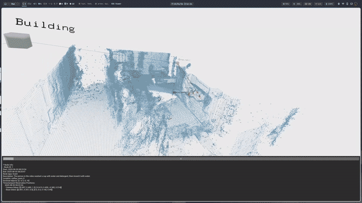

# 🥚🐣🐥 Event-Grounding Graph (EGG)

> **:warning: Warning**<br>
> This repository and some of its requirements are under active development, so bugs and breaking changes are expected.

## News

- **19/02/2025:** Dataset released on HuggingFace 🤗: https://huggingface.co/datasets/phuoc101/EGG-Dataset

- **14/02/2025:** Our paper got accepted to RA-L 🥳

## 🚀 Overview

<div align="center">
    
</div>

**Abstract:** A fundamental aspect for building intelligent autonomous
robots that can assist humans in their daily lives is the
construction of rich environmental representations. While advances in
semantic scene representations have enriched robotic
scene understanding, current approaches lack a connection
between the spatial features and dynamic event interactions.
In this work, we introduce event-grounding graph (EGG), a
framework grounding event interactions to spatial features of
a scene. This representation allows robots to perceive, reason,
and respond to complex spatio-temporal queries. Experiments
using real robotic data demonstrate EGG’s capability to re-
trieve relevant information and respond accurately to human
inquiries concerning the environment

**Authors:** Phuoc Nguyen, Francesco Verdoja, Ville Kyrki

**Affiliation:** Intelligent Robotics Group, School of Electrical Engineering, Aalto University

The prompts that are used for Generative AI are available [here](./Appendix.md)

If you find this code relevant for your work, please consider citing our paper. A bibtex entry is provided below:

```bibtex
@misc{nguyen2026eventgroundinggraphunifiedspatiotemporal,
      title={Event-Grounding Graph: Unified Spatio-Temporal Scene Graph from Robotic Observations}, 
      author={Phuoc Nguyen and Francesco Verdoja and Ville Kyrki},
      year={2026},
      eprint={2510.18697},
      archivePrefix={arXiv},
      primaryClass={cs.RO},
      url={https://arxiv.org/abs/2510.18697}, 
}
```

## 🤖 Requirements

We tested EGG on a laptop with an RTX 3070 GPU Mobile.

🐳 We highly recommend using Docker for deploying EGG. We provide pre-built Dockerfiles here (https://github.com/aalto-intelligent-robotics/EGG-docker)

If you do not want to use Docker for some reason, EGG was tested on Ubuntu 20.04. The other requirements are:

- [FlashAttention](https://github.com/Dao-AILab/flash-attention) (required by VideoRefer)
- [VideoRefer](https://github.com/phuoc101/PixelRefer) for auto video captioning, otherwise you can use the provided ground truth data (this is a fork of the [original work](https://github.com/DAMO-NLP-SG/PixelRefer) with updated dependencies)
- OpenAI AI API key (for graph pruning, evaluation, and generating image captions)
- We recommend uv for Python package managing. Instructions could be found [here](https://docs.astral.sh/uv/getting-started/installation/)

*TODO: Instructions for setting up with uv coming soon*

## 🧰 Building EGG

### 🐳 Setting up with Docker

Clone the Docker repo:

```bash
git clone https://github.com/aalto-intelligent-robotics/EGG-docker.git
cd EGG-docker/
```

Create these directories:

- `logs`: For EGG's output (debugging)
- `data`: For data
- `bags`: Put your ROS bags here (or create a symlink)

```
mkdir logs data bags
```

If you want to generate video captions automatically, you need to set up VideoRefer. The dependencies are automatically installed with Docker, so you only need to clone the source code.

```bash
mkdir third_party/
cd third_party
git clone git@github.com:phuoc101/PixelRefer.git
cd ..
```

Now build the docker image:

```bash
docker compose build base
```

Go grab yourself a coffee because this can take a while ☕

To start a container:

```bash
docker compose up base -d
docker exec -it egg_base bash
```

# Dataset

Our dataset is hosted on HuggingFace: https://huggingface.co/datasets/phuoc101/EGG-Dataset. To download it, follow these steps:

```bash
# Install git-xet to download large files
curl -sSfL https://hf.co/git-xet/install.sh | sh

cd data
git clone https://huggingface.co/datasets/phuoc101/EGG-Dataset
```

## 🔥 Quickstart

To start with EGG, you need to set up the data as folowed:

*Note: The dataset will be made public after the double-blind review process*

To build EGG, use one of the following:

```bash
cd workspace/egg/app
export OPENAI_API_KEY=<your OpenAI API key>
# To build a graph from ground truth
python3 build_graph.py -d <path_to_dataset>
# To build a graph with guided captioning (Requires GPU!)
python3 build_graph.py -d <path_to_dataset> -a
# To build a graph with unguided captioning (Requires GPU!)
python3 build_graph.py -d <path_to_dataset> -a -u
```

The result will be a json file, e.g., "graph_gt.json"

To visualize EGG, make sure you have open3d installed and run:

```bash
cd workspace/egg/app
python3 egg_visualizer.py
```

To try testing with a query:

```bash
cd workspace/egg/app
export OPENAI_API_KEY=<your OpenAI API key>
python3 graph_pruning.py -q "Enter your query here" -m "Choose one of < text|binary|time_point|node > --model "gpt-4o"

# To test with open-source models via Ollama, for example command-r
python3 graph_pruning.py -q "Enter your query here" -m "Choose one of < text|binary|time_point|node > --model "command-r"
```

To run the information retrieval benchmarks:

```bash
cd workspace/egg/app
export OPENAI_API_KEY=<your OpenAI API key>
# Change the strategy, the possible values are ['pruning_unified', 'pruning_unified_no_edge', 'spatial', 'event', 'no_edge', 'full_unified']
python3 run_benchmark.py -s pruning_unified -t 1 --model "gpt-4o"
python3 get_eval_results.py -f <the output file>
python3 analyze.py -r <the output file> -g <the graph used>
```
